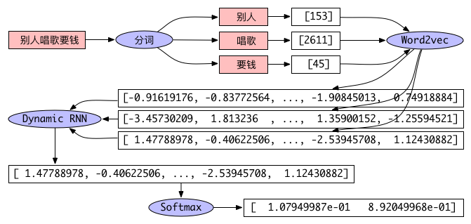
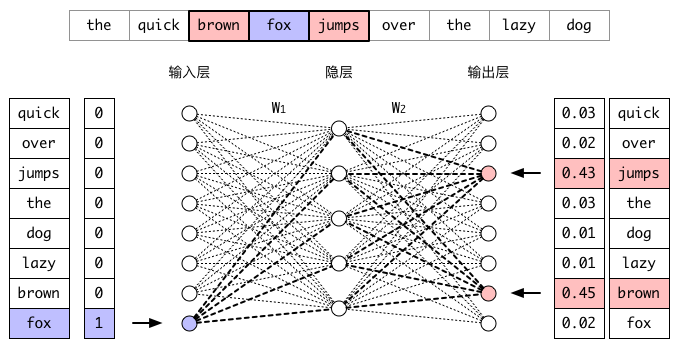
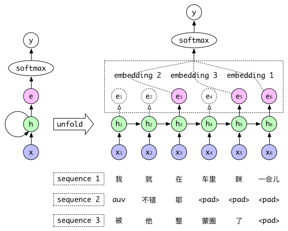

## 文本反垃圾

---
### 任务场景

文本反垃圾是网络社区应用非常常见的任务。因为各种利益关系，网络社区通常都难以避免地会涌入大量骚扰、色情、诈骗等垃圾信息，扰乱社区秩序，伤害用户体验。这些信息往往隐晦，多变，传统规则系统如正则表达式匹配关键词难以应对。通常情况下，文本反垃圾离不开用户行为分析，本章只针对文本内容部分进行讨论。

为了躲避平台监测，垃圾文本常常会使用火星文等方式对关键词进行隐藏。例如：

```
渴望 兂 极限 激情 恠 燃烧 加 涐 嶶 信 lovexxxx521
亲爱 的 看 頭潒 约
私人 企鹅 ⓧⓧⓧ㊆㊆⑧⑧⑧ 给 你 爽 你 懂 的
```

垃圾文本通常还会备有多个联系方式进行用户导流。识别异常联系方式是反垃圾的一项重要工作，但是传统的识别方法依赖大量策略，攻防压力大，也容易被突破。例如：

```
自啪 试平 n 罗辽 婊研 危性 xxxx447
自啪 试平 n 罗辽 婊研 危性 xxxxx11118
自啪 试平 n 罗辽 婊研 危性 xxxx2323
```

在这个实例中，我们将使用TensorLayer来训练一个垃圾文本分类器，并介绍如何通过TensorFlow Serving来提供高性能服务，实现产品化部署。这个分类器将解决以上几个难题，我们不再担心垃圾文本有多么隐晦，也不再关心它们用的哪国语言或有多少种联系方式。

第一步，[训练词向量](https://github.com/pakrchen/text-antispam/tree/master/word2vec)，相关代码在word2vec文件夹，执行步骤见word2vec/README.md。

第二步，[训练分类器](https://github.com/pakrchen/text-antispam/tree/master/network)，相关代码在network文件夹，执行步骤见network/README.md。

第三步，[与TensorFlow Serving交互](https://github.com/pakrchen/text-antispam/tree/master/serving)，客户端代码在serving文件夹。

### 网络结构

文本分类必然要先解决文本表征问题。文本表征在自然语言处理任务中扮演着重要的角色。它的目标是将不定长文本（句子、段落、文章）映射成固定长度的向量。
文本向量的质量会直接影响下游模型的性能。神经网络模型的文本表征工作通常分为两步，首先将单词映射成词向量，然后将词向量组合起来。
有多种模型能够将词向量组合成文本向量，例如词袋模型（Neural Bag-of-Words，NBOW）、递归神经网络（Recurrent Neural Network，RNN）和卷积神经网络（Convolutional Neural Network，CNN）。这些模型接受由一组词向量组成的文本序列作为输入，然后将文本的语义信息表示成一个固定长度的向量。
NBOW模型的优点是简单快速，配合多层全连接网络能实现不逊于RNN和CNN的分类效果，缺点是向量线性相加必然会丢失很多词与词相关信息，无法更精细地表达句子的语义。CNN在语言模型训练中也被广泛使用，这里卷积的作用变成了从句子中提取出局部的语义组合信息，多个卷积核则用来保证提取的语义组合的多样性。
RNN常用于处理时间序列数据，它能够接受任意长度的输入，是自然语言处理最受欢迎的架构之一，在短文本分类中，相比NBOW和CNN的缺点是需要的计算时间更长。

实例中我们使用RNN来表征文本，将输入的文本序列通过一个RNN层映射成固定长度的向量，然后将文本向量输入到一个Softmax层进行分类。
本章结尾我们会再简单介绍由NBOW和多层感知机（Multilayer Perceptron，MLP）组成的分类器和CNN分类器。实际分类结果中，以上三种分类器的
准确率都能达到97%以上。如图1所示，相比之前训练的SVM分类器所达到的93%左右的准确率，基于神经网络的垃圾文本分类器表现出非常优秀的性能。

<div align="center">

<br>
<em align="center">图1 Word2vec与Dynamic RNN</em>
</div>

### 词的向量表示

最简单的词表示方法是One-hot Representation，即把每个词表示为一个很长的向量，这个向量的维度是词表的大小，其中只有一个维度的值为1，其余都为0，这个维度就代表了当前的词。这种表示方法非常简洁，但是容易造成维数灾难，并且无法描述词与词之间的关系。还有一种表示方法是Distributed Representation，如Word2vec。这种方法把词表示成一种稠密、低维的实数向量。该向量可以表示一个词在一个`N`维空间中的位置，并且相似词在空间中的位置相近。由于训练的时候就利用了单词的上下文，因此Word2vec训练出来的词向量天然带有一些句法和语义特征。它的每一维表示词语的一个潜在特征，可以通过空间距离来描述词与词之间的相似性。

比较有代表性的Word2vec模型有CBOW模型和Skip-Gram模型。图2演示了Skip-Gram模型的训练过程。假设我们的窗口取1，通过滑动窗口我们得到`(fox, brown)`、`(fox, jumps)`等输入输出对，经过足够多次的迭代后，当我们再次输入`fox`时，`jumps`和`brown`的概率会明显高于其他词。在输入层与隐层之间的矩阵`W1`存储着每一个单词的词向量，从输入层到隐层之间的计算就是取出单词的词向量。因为训练的目标是相似词得到相似上下文，所以相似词在隐层的输出（即其词向量）在优化过程中会越来越接近。训练完成后我们把`W1`（词向量集合）保存起来用于后续的任务。

<div align="center">

<br>
<em align="center">图2 Word2vec训练过程</em>
</div>

### Dynamic RNN分类器

传统神经网络如MLP受限于固定大小的输入，以及静态的输入输出关系，在动态系统建模任务中会遇到比较大的困难。传统神经网络假设所有输入都互相独立，其有向无环的神经网络的各层神经元不会互相作用，不好处理前后输入有关联的问题。但是现实生活中很多问题都是以动态系统的方式呈现的，一件事物的现状往往依托于它之前的状态。虽然也能通过将一长段时间分成多个同等长度的时间窗口来计算时间窗口内的相关内容，但是这个时间窗的依赖与变化都太多，大小并不好取。目前常用的一种RNN是LSTM，它与标准RNN的不同之处是隐层单元的计算函数更加复杂，使得RNN的记忆能力变得更强。

在训练RNN的时候我们会遇到另一个问题。不定长序列的长度有可能范围很广，Static RNN由于只构建一次Graph，训练前需要对所有输入进行Padding以确保整个迭代过程中每个Batch的长度一致，这样输入的长度就取决于训练集最长的一个序列，导致许多计算资源浪费在Padding部分。Dynamic RNN实现了Graph动态生成，因此不同Batch的长度可以不同，并且可以跳过Padding部分的计算。这样每一个Batch的数据在输入前只需Padding到该Batch最长序列的长度，并且根据序列实际长度中止计算，从而减少空间和计算量。

图3演示了Dynamic RNN分类器的训练过程，Sequence 1、2、3作为一个Batch输入到网络中，这个Batch最长的长度是6，因此左方RNN Graph展开后如右方所示是一个有着6个隐层的网络，每一层的输出会和下一个词一起作为输入进入到下一层。第1个序列的长度为6，因此我们取第6个输出作为这个序列的Embedding输入到Softmax层进行分类。第2个序列的长度为3，因此我们在计算到第3个输出时就停止计算，取第3个输出作为这个序列的Embedding输入到Softmax层进行后续的计算。依此类推，第3个序列取第5个输出作为Softmax层的输入，完成一次前向与后向传播。

<div align="center">

<br>
<em align="center">图3 Dynamic RNN训练过程</em>
</div>
