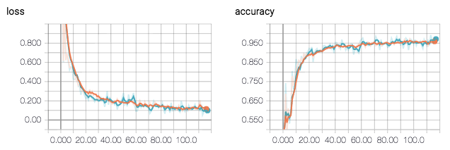
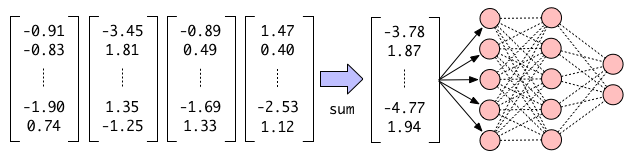
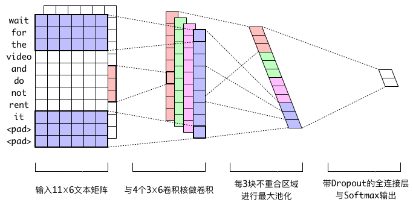

### 训练RNN分类器并导出Servable

```
python3 rnn_classifier.py
```

### 训练MLP分类器并导出Servable

```
python3 mlp_classifier.py
```

### 训练CNN分类器并导出Servable

```
python3 cnn_classifier.py
```
#### 模型构建
##### 训练分类器
我们使用Dynamic RNN实现不定长文本序列分类。首先加载数据，通过`sklearn`库的`train_test_split`方法将样本按照要求的比例切分成训练集和测试集。

```python
def load_dataset(files, test_size=0.2):
    """加载样本并取test_size的比例做测试集
    Args:
        files: 样本文件目录集合
            样本文件是包含了样本特征向量与标签的npy文件
        test_size: float
            0.0到1.0之间，代表数据集中有多少比例抽做测试集
    Returns:
        X_train, y_train: 训练集特征列表和标签列表
        X_test, y_test: 测试集特征列表和标签列表
    """
    x = []
    y = []
    for file in files:
        data = np.load(file, allow_pickle=True)
        if x == [] or y == []:
            x = data['x']
            y = data['y']
        else:
            x = np.append(x, data['x'], axis=0)
            y = np.append(y, data['y'], axis=0)

    x_train, x_test, y_train, y_test = train_test_split(x, y, test_size=test_size)
    return x_train, y_train, x_test, y_test
```

为了防止过拟合，我们对Dynamic RNN的隐藏层做了Dropout操作。参数`recurrent_dropout`决定了隐藏层的舍弃比例。通过配置`recurrent_dropout`参数我们可以在训练的时候打开Dropout，在服务的时候关闭它。需要特别注意的是，我们在RNN层传入了`sequence length`来表示每个输入文本的长度。根据Tensorlayer官方文档，只有提供了`sequence length` RNN才是一个Dynamic RNN。计算`sequence length`的方程`retrieve_seq_length_op3`需要指定padding值，在该项目中是维度为200的全零矩阵。

```python
def get_model(inputs_shape):
    """定义网络结Args:
        inputs_shape: 输入数据的shape
        recurrent_dropout: RNN隐藏层的舍弃比重
    Returns:
        model: 定义好的模型
    """
    ni = tl.layers.Input(inputs_shape, name='input_layer')
    out = tl.layers.RNN(cell=tf.keras.layers.LSTMCell(units=64, recurrent_dropout=0.2),
                        return_last_output=True,
                        return_last_state=False,
                        return_seq_2d=True)(ni, sequence_length=tl.layers.retrieve_seq_length_op3(ni, pad_val=masking_val))
    nn = tl.layers.Dense(n_units=2, act=tf.nn.softmax, name="dense")(out)
    model = tl.models.Model(inputs=ni, outputs=nn, name='rnn')
    return model
```
例子中每一次迭代，我们给网络输入128条文本序列。根据预测与标签的差异，网络不断优化权重，减少损失，逐步提高分类的准确率。

```python
def train(model):
    # 开始训练
    learning_rate = 0.001
    n_epoch = 50
    batch_size = 128
    display_step = 10
    loss_vals = []
    acc_vals = []
    optimizer = tf.optimizers.Nadam(learning_rate=learning_rate)

    logging.info("batch_size: %d", batch_size)
    logging.info("Start training the network...")

    for epoch in range(n_epoch):
        step = 0
        total_step = math.ceil(len(x_train) / batch_size)

        # 利用训练集训练
        model.train()
        for batch_x, batch_y in tl.iterate.minibatches(x_train, y_train, batch_size, shuffle=True):

            start_time = time.time()
            # temp = copy.deepcopy(batch_x)
            max_seq_len = max([len(d) for d in batch_x])
            batch_y = batch_y.astype(np.int32)
            for i, d in enumerate(batch_x):
                batch_x[i] += [tf.convert_to_tensor(np.zeros(200), dtype=tf.float32) for i in
                               range(max_seq_len - len(d))]
                batch_x[i] = tf.convert_to_tensor(batch_x[i], dtype=tf.float32)
            batch_x = list(batch_x)
            batch_x = tf.convert_to_tensor(batch_x, dtype=tf.float32)
            # sequence_length = tl.layers.retrieve_seq_length_op3(batch_x, pad_val=masking_val)

            with tf.GradientTape() as tape:
                _y = model(batch_x)
                loss_val = tf.nn.sparse_softmax_cross_entropy_with_logits(batch_y, _y, name='train_loss')
                loss_val = tf.reduce_mean(loss_val)
            grad = tape.gradient(loss_val, model.trainable_weights)
            optimizer.apply_gradients(zip(grad, model.trainable_weights))

            loss_vals.append(loss_val)
            acc_vals.append(accuracy(_y, batch_y))

            if step + 1 == 1 or (step + 1) % display_step == 0:
                logging.info("Epoch {}/{},Step {}/{}, took {}".format(epoch + 1, n_epoch, step, total_step,
                                                                      time.time() - start_time))
                loss = sum(loss_vals) / len(loss_vals)
                acc = sum(acc_vals) / len(acc_vals)
                del loss_vals[:]
                del acc_vals[:]
                logging.info(
                    "Minibatch Loss= " + "{:.6f}".format(loss) + ", Training Accuracy= " + "{:.5f}".format(acc))
            step += 1

        with train_summary_writer.as_default():
            tf.summary.scalar('loss', loss_val.numpy(), step = epoch)
            tf.summary.scalar('accuracy', accuracy(_y, batch_y).numpy(), step = epoch)

        # 利用测试集评估
        model.eval()
        test_loss, test_acc, n_iter = 0, 0, 0
        for batch_x, batch_y in tl.iterate.minibatches(x_test, y_test, batch_size, shuffle=True):
            batch_y = batch_y.astype(np.int32)
            max_seq_len = max([len(d) for d in batch_x])
            for i, d in enumerate(batch_x):
                # 依照每个batch中最大样本长度将剩余样本打上padding
                batch_x[i] += [tf.convert_to_tensor(np.zeros(200), dtype=tf.float32) for i in
                               range(max_seq_len - len(d))]
                batch_x[i] = tf.convert_to_tensor(batch_x[i], dtype=tf.float32)
            # ValueError: setting an array element with a sequence.
            batch_x = list(batch_x)
            batch_x = tf.convert_to_tensor(batch_x, dtype=tf.float32)

            _y = model(batch_x)

            loss_val = tf.nn.sparse_softmax_cross_entropy_with_logits(batch_y, _y, name='test_loss')
            loss_val = tf.reduce_mean(loss_val)

            test_loss += loss_val
            test_acc += accuracy(_y, batch_y)
            n_iter += 1

        with test_summary_writer.as_default():
            tf.summary.scalar('loss', loss_val.numpy(), step=epoch)
            tf.summary.scalar('accuracy', accuracy(_y, batch_y).numpy(), step=epoch)

        logging.info("   test loss: {}".format(test_loss / n_iter))
        logging.info("   test acc:  {}".format(test_acc / n_iter))
```

在模型训练到60个epoch之后，训练集与测试集的准确率都上升到了95%以上。

<div align="center">

<br>
<em align="center">图4 Dynamic RNN Loss and Accuracy</em>
</div>


##### 模型导出

TensorFlow提供了SavedModel这一格式专门用于保存可在多平台部署的文件，然而在TensorFlow2这一版本中，用于保存SavedModel的方法`tf.saved_model.save`仅支持对Trackable对象的模型导出。由于Trackable在Tensorflow2中是keras.model的父类，而TensorLayer构建的model不继承Trackable类，因此我们构建的model无法用`tf.saved_model.save`导出可部署文件。

在这里，我们的解决思路是先将TensorLayer模型保存为hdf5文件，再设计一套转译机制，将该hdf5文件转成tf.keras可以读取的形式，然后再由`tf.saved_model.save`方法进行模型导出。

hdf5文件从TensorLayer到keras的转译，被分为weights和config两部分。

```python
def translator_tl2_keras_h5(_tl_h5_path, _keras_h5_path):
    f_tl_ = h5py.File(_tl_h5_path, 'r+')
    f_k_ = h5py.File(_keras_h5_path, 'a')
    f_k_.clear()
    weights_translator(f_tl_, f_k_)
    config_translator(f_tl_, f_k_)
    f_tl_.close()
    f_k_.close()
```

weights_translator将训练过程中学习到的权重(例如bias和kernel)进行转译。

```python
def weights_translator(f_tl, f_k):
    # todo: delete inputlayer
    if 'model_weights' not in f_k.keys():
        f_k_model_weights = f_k.create_group('model_weights')
    else:
        f_k_model_weights = f_k['model_weights']
    for key in f_tl.keys():
        if key not in f_k_model_weights.keys():
            f_k_model_weights.create_group(key)
        try:
            f_tl_para = f_tl[key][key]
        except KeyError:
            pass
        else:
            if key not in f_k_model_weights[key].keys():
                f_k_model_weights[key].create_group(key)
            weight_names = []
            f_k_para = f_k_model_weights[key][key]
            # todo：对RNN层的weights进行通用适配
            cell_name = ''
            if key == 'rnn_1':
                cell_name = 'lstm_cell'
                f_k_para.create_group(cell_name)
                f_k_para = f_k_para[cell_name]
                f_k_model_weights.create_group('masking')
                f_k_model_weights['masking'].attrs['weight_names'] = []
            for k in f_tl_para:
                if k == 'biases:0' or k == 'bias:0':
                    weight_name = 'bias:0'
                elif k == 'filters:0' or k == 'weights:0' or k == 'kernel:0':
                    weight_name = 'kernel:0'
                elif k == 'recurrent_kernel:0':
                    weight_name = 'recurrent_kernel:0'
                else:
                    raise Exception("cant find the parameter '{}' in tensorlayer".format(k))
                if weight_name in f_k_para:
                    del f_k_para[weight_name]
                f_k_para.create_dataset(name=weight_name, data=f_tl_para[k][:],
                                                           shape=f_tl_para[k].shape)

        weight_names = []
        for weight_name in f_tl[key].attrs['weight_names']:
            weight_name = weight_name.decode('utf8')
            weight_name = weight_name.split('/')
            k = weight_name[-1]
            if k == 'biases:0' or k == 'bias:0':
                weight_name[-1] = 'bias:0'
            elif k == 'filters:0' or k == 'weights:0' or k == 'kernel:0':
                weight_name[-1] = 'kernel:0'
            elif k == 'recurrent_kernel:0':
                weight_name[-1] = 'recurrent_kernel:0'
            else:
                raise Exception("cant find the parameter '{}' in tensorlayer".format(k))
            if key == 'rnn_1':
                weight_name.insert(-1, 'lstm_cell')
            weight_name = '/'.join(weight_name)
            weight_names.append(weight_name.encode('utf8'))
        f_k_model_weights[key].attrs['weight_names'] = weight_names

    f_k_model_weights.attrs['backend'] = keras.backend.backend().encode('utf8')
    f_k_model_weights.attrs['keras_version'] = str(keras.__version__).encode('utf8')

    f_k_model_weights.attrs['layer_names'] = [i for i in f_tl.attrs['layer_names']]
```

config_translator转译了模型的config信息，包括了模型的结构，和训练过程中的loss，metrics，optimizer等信息。

```PYTHON
def config_translator(f_tl, f_k):
    tl_model_config = f_tl.attrs['model_config'].decode('utf8')
    tl_model_config = eval(tl_model_config)
    tl_model_architecture = tl_model_config['model_architecture']

    k_layers = []
    for key, tl_layer in enumerate(tl_model_architecture):
        if key == 1:
            k_layer = layer_translator(tl_layer, is_first_layer=True)
        else:
            k_layer = layer_translator(tl_layer)
        if k_layer is not None:
            k_layers.append(k_layer)
    f_k.attrs['model_config'] = json.dumps({'class_name': 'Sequential',
                                            'config': {'name': 'sequential', 'layers': k_layers},
                                            'build_input_shape': input_shape},
                                           default=serialization.get_json_type).encode('utf8')
    f_k.attrs['backend'] = keras.backend.backend().encode('utf8')
    f_k.attrs['keras_version'] = str(keras.__version__).encode('utf8')

    # todo: translate the 'training_config'
    training_config = {'loss': {'class_name': 'SparseCategoricalCrossentropy',
                                'config': {'reduction': 'auto', 'name': 'sparse_categorical_crossentropy',
                                           'from_logits': False}},
                       'metrics': ['accuracy'], 'weighted_metrics': None, 'loss_weights': None, 'sample_weight_mode': None,
                       'optimizer_config': {'class_name': 'Adam',
                                            'config': {'name': 'Adam', 'learning_rate': 0.01, 'decay': 0.0,
                                                       'beta_1': 0.9, 'beta_2': 0.999, 'epsilon': 1e-07, 'amsgrad': False
                                                       }
                                            }
                       }

    f_k.attrs['training_config'] = json.dumps(training_config, default=serialization.get_json_type).encode('utf8')
```

TensorLayer和keras的模型在保存config时，都是以layer为单位分别保存，于是在translate时，我们按照每个层的类型进行逐层转译。

```PYTHON
def layer_translator(tl_layer, is_first_layer=False):
    _input_shape = None
    global input_shape
    if is_first_layer:
        _input_shape = input_shape
    if tl_layer['class'] == '_InputLayer':
        input_shape = tl_layer['args']['shape']
    elif tl_layer['class'] == 'Conv1d':
        return layer_conv1d_translator(tl_layer, _input_shape)
    elif tl_layer['class'] == 'MaxPool1d':
        return layer_maxpooling1d_translator(tl_layer, _input_shape)
    elif tl_layer['class'] == 'Flatten':
        return layer_flatten_translator(tl_layer, _input_shape)
    elif tl_layer['class'] == 'Dropout':
        return layer_dropout_translator(tl_layer, _input_shape)
    elif tl_layer['class'] == 'Dense':
        return layer_dense_translator(tl_layer, _input_shape)
    elif tl_layer['class'] == 'RNN':
        return layer_rnn_translator(tl_layer, _input_shape)
    return None
```

以rnn层为例，我们设计了其config的转译方法。

```PYTHON
def layer_rnn_translator(tl_layer, _input_shape=None):
    args = tl_layer['args']
    name = args['name']
    cell = args['cell']
    config = {'name': name, 'trainable': True, 'dtype': 'float32', 'return_sequences': False,
              'return_state': False, 'go_backwards': False, 'stateful': False, 'unroll': False, 'time_major': False,
              'cell': cell
              }
    if _input_shape is not None:
        config['batch_input_shape'] = _input_shape
    result = {'class_name': 'RNN', 'config': config}
    return result
```

按照main函数的顺序，分类器完成了训练和导出模型的全部步骤。

```python
if __name__ == '__main__':

    masking_val = np.zeros(200)
    input_shape = None
    gradient_log_dir = 'logs/gradient_tape/'
    tensorboard = TensorBoard(log_dir = gradient_log_dir)

    # 定义log格式
    fmt = "%(asctime)s %(levelname)s %(message)s"
    logging.basicConfig(format=fmt, level=logging.INFO)

    # 加载数据
    x_train, y_train, x_test, y_test = load_dataset(
        ["../word2vec/output/sample_seq_pass.npz",
         "../word2vec/output/sample_seq_spam.npz"])

    # 构建模型
    model = get_model(inputs_shape=[None, None, 200])

    for index, layer in enumerate(model.config['model_architecture']):
        if layer['class'] == 'RNN':
            if 'cell' in layer['args']:
                model.config['model_architecture'][index]['args']['cell'] = ''

    current_time = datetime.datetime.now().strftime('%Y%m%d-%H%M%S')
    train_log_dir = gradient_log_dir + current_time + '/train'
    test_log_dir = gradient_log_dir + current_time + '/test'
    train_summary_writer = tf.summary.create_file_writer(train_log_dir)
    test_summary_writer = tf.summary.create_file_writer(test_log_dir)

    train(model)

    logging.info("Optimization Finished!")

    # h5保存和转译
    model_dir = './model_h5'
    if not os.path.exists(model_dir):
        os.mkdir(model_dir)
    tl_h5_path = model_dir + '/model_rnn_tl.hdf5'
    keras_h5_path = model_dir + '/model_rnn_tl2k.hdf5'
    tl.files.save_hdf5_graph(network=model, filepath=tl_h5_path, save_weights=True)
    translator_tl2_keras_h5(tl_h5_path, keras_h5_path)

    # 读取模型
    new_model = keras.models.load_model(keras_h5_path)
    x_test, y_test = format_convert(x_test, y_test)
    score = new_model.evaluate(x_test, y_test, batch_size=128)

    # 保存SavedModel可部署文件
    saved_model_version = 1
    saved_model_path = "./saved_models/rnn/"
    tf.saved_model.save(new_model, saved_model_path + str(saved_model_version))
```

最终我们将在`./saved_models/rnn`目录下看到导出模型的每个版本，实例中`model_version`被设置为1，因此创建了相应的子目录`./saved_models/rnn/1`。

SavedModel目录具有以下结构。

```
assets/
variables/
    variables.data-?????-of-?????
    variables.index
saved_model.pb
```

导出的模型在TensorFlow Serving中又被称为Servable，其中`saved_model.pb`保存了接口的数据交换格式，`variables`保存了模型的网络结构和参数，`assets`用来保存如词库等模型初始化所需的外部资源。本例没有用到外部资源，因此没有`assets`文件夹。

#### 其他常用方法

##### MLP分类器

前文提到过，分类器还可以用NBOW+MLP（如图5所示）和CNN来实现。借助TensorLayer，我们可以很方便地重组网络。下面简单介绍这两种网络的结构及其实现。

由于词向量之间存在着线性平移的关系，如果相似词空间距离相近，那么在仅仅将文本中一个或几个词改成近义词的情况下，两个文本的词向量线性相加的结果也应该是非常接近的。

<div align="center">

<br>
<em align="center">图5 NBOW+MLP分类器</em>
</div>

多层神经网络可以无限逼近任意函数，能够胜任复杂的非线性分类任务。下面的代码将Word2vec训练好的词向量线性相加，再通过三层全连接网络进行分类。
```python
def get_model(input_shape, keep=0.5):
    """定义网络结构

    Args:
        inputs_shape: 输入数据的shape
        keep: 各层神经元激活比例
            keep=1.0: 关闭Dropout
    Returns:
        model: 定义好的网络结构
    """
    ni = tl.layers.Input(input_shape, name='input_layer')
    nn = tl.layers.Dropout(keep=keep, name='drop1')(ni)
    nn = tl.layers.Dense(n_units=200, act=tf.nn.relu, name='relu1')(nn)
    nn = tl.layers.Dropout(keep=keep, name='drop2')(nn)
    nn = tl.layers.Dense(n_units=200, act=tf.nn.relu, name='relu2')(nn)
    nn = tl.layers.Dropout(keep=keep, name='drop3')(nn)
    nn = tl.layers.Dense(n_units=2, act=tf.nn.relu, name='output_layer')(nn)
    model = tl.models.Model(inputs=ni, outputs=nn, name='mlp')
    return model
```
##### CNN分类器
CNN卷积的过程捕捉了文本的局部相关性，在文本分类中也取得了不错的结果。图6演示了CNN分类过程。输入是一个由6维词向量组成的最大长度为11的文本，经过与4个3×6的卷积核进行卷积，得到4张9维的特征图。再对特征图每3块不重合区域进行最大池化，将结果合成一个12维的向量输入到全连接层。

<div align="center">

<br>
<em align="center">图6 CNN分类器</em>
</div>

下面代码中输入是一个由200维词向量组成的最大长度为20的文本（确定好文本的最大长度后，我们需要对输入进行截取或者填充）。卷积层参数[3, 200, 6]代表6个3×200的卷积核。这里使用1D CNN，是因为我们把文本序列看成一维数据，这意味着卷积的过程只会朝一个方向进行（同理，处理图片和小视频分别需要使用2D CNN和3D CNN）。卷积核宽度被设置为和词向量大小一致，确保了词向量作为最基本的元素不会被破坏。我们选取连续的3维作为池化区域，滑动步长取3，使得池化区域不重合，最后通过一个带Dropout的全连接层得到Softmax后的输出。
```python
def get_model(inputs_shape, keep=0.5):
    """定义网络结构
    Args:
        inputs_shape: 输入数据的shape
        keep: 全连接层输入神经元激活比例
            keep=1.0: 关闭Dropout
    Returns:
        network: 定义好的网络结构
    """
    ni = tl.layers.Input(inputs_shape, name='input_layer')
    nn = tl.layers.Conv1d(n_filter=6, filter_size=3, stride=2, in_channels=200, name='conv1d_1')(ni)
    # nn = tl.layers.Conv1dLayer(act=tf.nn.relu, shape=[3, 200, 6], name='cnn_layer1', padding='VALID')(ni)
    nn = tl.layers.MaxPool1d(filter_size=3, strides=3, name='pool_layer1')(nn)
    nn = tl.layers.Flatten(name='flatten_layer')(nn)
    nn = tl.layers.Dropout(keep=keep, name='drop1')(nn)
    nn = tl.layers.Dense(n_units=2, act=tf.nn.relu, name="output")(nn)

    model = tl.models.Model(inputs=ni, outputs=nn, name='cnn')
    return model
```
