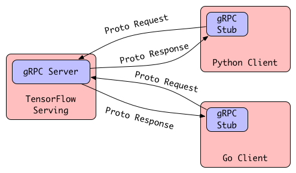

### TensorFlow Serving部署

反垃圾服务分为线上与线下两层。线上实时服务要求毫秒级判断文本是否属于垃圾文本，线下离线计算需要根据新进的样本不断更新模型，并及时推送到线上。

图8所示的分类器就是用TensorFlow Serving提供的服务。TensorFlow Serving是一个灵活、高性能的机器学习模型服务系统，专为生产环境而设计。它可以将训练好的机器学习模型轻松部署到线上，并且支持热更新。它使用gRPC作为接口框架接受外部调用，服务稳定，接口简单。这些优秀特性使我们能够专注于线下模型训练。

<div align="center">

<br>
<em align="center">图8 反垃圾服务架构</em>
</div>

为什么使用TensorFlow Serving而不是直接启动多个加载了模型的Python进程来提供线上服务？因为重复引入TensorFlow并加载模型的Python进程浪费资源并且运行效率不高。而且TensorFlow本身有一些限制导致并不是所有时候都能启动多个进程。TensorFlow默认会使用尽可能多的GPU并且占用所使用的GPU。因此如果有一个TensorFlow进程正在运行，可能导致其他TensorFlow进程无法启动。虽然可以指定程序使用特定的GPU，但是进程的数量也受到GPU数量的限制，总体来说不利于分布式部署。而TensorFlow Serving提供了一个高效的分布式解决方案。当新数据可用或改进模型时，加载并迭代模型是很常见的。TensorFlow Serving能够实现模型生命周期管理，它能自动检测并加载最新模型或回退到上一个模型，非常适用于高频迭代场景。

*现在通过Docker使用Tensorflow Serving已经非常方便了，建议大家直接参考[TensorFlow Serving with Docker](https://www.tensorflow.org/tfx/serving/docker)这篇文档安装TensorFlow Serving。*

```
$ docker pull tensorflow/serving
```

部署的方式非常简单，只需在启动TensorFlow Serving时加载Servable并定义`model_name`即可，这里的`model_name`将用于与客户端进行交互。运行TensorFlow Serving并从指定目录加载Servable的Docker命令为：

```
$ docker run -dt -p 8501:8501 -v /Users/code/task/text_antispam_tl2/network/saved_models:/models/saved_model -e MODEL_NAME=saved_model tensorflow/serving &
```

冒号前是模型保存的路径（注意不包括版本号）。run命令的一些常用参数说明如下：

```
-a stdin: 指定标准输入输出内容类型，可选 STDIN/STDOUT/STDERR 三项；
-d: 后台运行容器，并返回容器ID；
-i: 以交互模式运行容器，通常与 -t 同时使用；
-P: 随机端口映射，容器内部端口随机映射到主机的端口
-p: 指定端口映射，格式为：主机(宿主)端口:容器端口
-t: 为容器重新分配一个伪输入终端，通常与 -i 同时使用；
--name="nginx-lb": 为容器指定一个名称；
--dns 8.8.8.8: 指定容器使用的DNS服务器，默认和宿主一致；
--dns-search example.com: 指定容器DNS搜索域名，默认和宿主一致；
-h "mars": 指定容器的hostname；
-e username="ritchie": 设置环境变量；
--env-file=[]: 从指定文件读入环境变量；
--cpuset="0-2" or --cpuset="0,1,2": 绑定容器到指定CPU运行；
-m :设置容器使用内存最大值；
--net="bridge": 指定容器的网络连接类型，支持 bridge/host/none/container: 四种类型；
--link=[]: 添加链接到另一个容器；
--expose=[]: 开放一个端口或一组端口；
--volume , -v: 绑定一个卷
-dt表示后台运行容器，并返回容器ID可以看到TensorFlow Serving成功加载了我们刚刚导出的模型。
```

运行完可以看到运行的tfs容器ID。还可以进一步查看保存模型的Signature（用于验证模型是否成功保存）：
```
saved_model_cli show --dir /Users/code/task/text_antispam_tl2/network/saved_models/1 --all
```

输出信息类似以下形式：

```
signature_def['serving_default']:
  The given SavedModel SignatureDef contains the following input(s):
    inputs['conv1d_1_input'] tensor_info:
        dtype: DT_FLOAT
        shape: (-1, 20, 200)
        name: serving_default_conv1d_1_input:0
  The given SavedModel SignatureDef contains the following output(s):
    outputs['output'] tensor_info:
        dtype: DT_FLOAT
        shape: (-1, 2)
        name: StatefulPartitionedCall:0
  Method name is: tensorflow/serving/predict
```

### 客户端调用

TensorFlow Serving通过gRPC框架接收外部调用。gRPC是一种高性能、通用的远程过程调用（Remote Procedure Call，RPC）框架。RPC协议包含了编码协议和传输协议。gRPC的编码协议是Protocol Buffers（ProtoBuf），它是Google开发的一种二进制格式数据描述语言，支持众多开发语言和平台。与JSON、XML相比，ProtoBuf的优点是体积小、速度快，其序列化与反序列化代码都是通过代码生成器根据定义好的数据结构生成的，使用起来也很简单。gRPC的传输协议是HTTP/2，相比于HTTP/1.1，HTTP/2引入了头部压缩算法（HPACK）等新特性，并采用了二进制而非明文来打包、传输客户端——服务器间的数据，性能更好，功能更强。总而言之，gRPC提供了一种简单的方法来精确地定义服务，并自动为客户端生成可靠性很强的功能库，如图7所示。

在使用gRPC进行通信之前，我们需要完成两步操作：1）定义服务；2）生成服务端和客户端代码。定义服务这块工作TensorFlow Serving已经帮我们完成了。在[TensorFlow Serving](https://github.com/tensorflow/serving)项目中，我们可以在以下目录找到三个`.proto`文件：`model.proto`、`predict.proto`和`prediction_service.proto`。这三个`.proto`文件定义了一次预测请求的输入和输出。例如一次预测请求应该包含哪些元数据（如模型的名称和版本），以及输入、输出与Tensor如何转换。

<div align="center">

<br>
<em align="center">图9 客户端与服务端使用gRPC进行通信</em>
</div>

```
$ tree serving
serving
├── tensorflow
│   ├── ...
├── tensorflow_serving
│   ├── apis
│   │   ├── model.proto
│   │   ├── predict.proto
│   │   ├── prediction_service.proto
│   │   ├── ...
│   ├── ...
├── ...
```

接下来写一个简单的客户端程序来调用部署好的模型。以RNN Classifier为例，`serving_rnn.py`负责构建一个Request用于与TensorFlow Serving交互。为了描述简洁，这里分词使用了结巴分词，词向量也是直接载入内存，实际生产环境中分词与词向量获取是一个单独的服务。特别需要注意的是，输入的签名和数据必须与之前导出的模型相匹配。

```
import json
import tornado.ioloop
import tornado.web
import tensorflow as tf
import jieba
import tensorlayer as tl
from packages import text_regularization as tr
import numpy as np
import requests


print(" ".join(jieba.cut('分词初始化')))
wv = tl.files.load_npy_to_any(name='../word2vec/output/model_word2vec_200.npy')


def text_tensor(text, wv):
    """获取文本向量
    Args:
        text: 待检测文本
        wv: 词向量模型
    Returns:
        [[[ 3.80905056   2.94315064  -0.20703495  -2.31589055   2.9627794
           ...
           2.16935492   2.95426321  -4.71534014  -3.25034237 -11.28901672]]]
    """
    text = tr.extractWords(text)
    words = jieba.cut(text.strip())
    text_sequence = []
    for word in words:
        try:
            text_sequence.append(wv[word])
        except KeyError:
            text_sequence.append(wv['UNK'])
    text_sequence = np.asarray(text_sequence)
    sample = text_sequence.reshape(1, len(text_sequence), 200)
    return sample
```

接下来定义请求处理类MainHandler负责接收和处理请求。生产环境中一般使用反向代理软件如Nginx实现负载均衡。这里我们演示直接监听80端口来提供HTTP服务。

```
class MainHandler(tornado.web.RequestHandler):
    """请求处理类
    """

    def get(self):
        """处理GET请求
        """
        text = self.get_argument("text")
        predict = self.classify(text)
        data = {
            'text' : text,
            'predict' : str(predict[0])
        }
        self.write(json.dumps({'data': data}))

    def classify(self, text):
        """调用引擎检测文本
        Args:
            text: 待检测文本
        Returns:
            垃圾返回[0]，通过返回[1]
        """
        sample = text_tensor(text, wv)
        sample = np.array(sample, dtype=np.float32)
        len = sample.shape[1]
        sample = sample.reshape(len, 200)

        sample = sample.reshape(1, len, 200)
        data = json.dumps({
            # "signature_name": "call",
            "instances": sample.tolist()
        })
        headers = {"content-type": "application/json"}
        json_response = requests.post(
            'http://localhost:8501/v1/models/saved_model:predict',
            data=data, headers=headers)

        predictions = np.array(json.loads(json_response.text)['predictions'])
        result = np.argmax(predictions, axis=-1)
        return result

def make_app():
    """定义并返回Tornado Web Application
    """
    return tornado.web.Application([
        (r"/predict", MainHandler),
    ])


if __name__ == "__main__":
    app = make_app()
    app.listen(80)
    print("listen start")
    tornado.ioloop.IOLoop.current().start()
```

在运行上述代码后，如果是在本地启动服务，访问`http://127.0.0.1/predict?text=加我微信xxxxx有福利`，可以看到如下结果。

```
{
    "data": {
        "text": "\u52a0\u6211\u5fae\u4fe1xxxxx\u6709\u798f\u5229",
        "predict": 0
    }
}
```

成功识别出垃圾消息。

