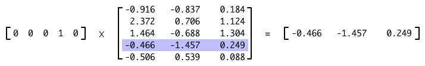

### 训练词向量

```
python3 word2vec.py
```

### 为MLP分类器准备训练集

```
python3 text2vec.py
```

### 为CNN或RNN分类器准备训练集

```
python3 text_features.py
```

### 训练网络

网络的训练分为两段：一段是词向量的训练，一段是分类器的训练。训练好的词向量在分类器的训练过程中不会再更新。

#### 训练词向量

本例Word2vec训练集的大部分内容都是短文本，经过了基本的特殊字符处理和分词。关于分词，由于用户多样的聊天习惯，文本中会出现大量新词或者火星文，垃圾文本更有各种只可意会不可言传的词出现，因此好的分词器还有赖于新词发现，这是另外一个话题了。因为分词的实现不是本章的重点，所以例子中所有涉及分词的部分都会使用Python上流行的开源分词器结巴分词（Jieba）。作为一款优秀的分词器，它用来训练是完全不成问题的。

正样本示例：

```
得 我 就 在 车里 咪 一会
auv 不错 耶
不 忘 初心 方 得 始终 你 的 面相 是 有 志向 的 人
```

负样本示例：

```
帅哥哥 约 吗 v 信 xx88775 么 么 哒 你 懂 的
想 在 这里 有个 故事 xxxxx2587
不再 珈 矀 信 xxx885 无 需要 低线 得 唠嗑
```

首先加载训练数据。例子中词向量的训练集和接下来分类器所用的训练集是一样的，但是实际场景中词向量的训练集一般比分类器的大很多。因为词向量的训练集是无须打标签的数据，这使得我们可以利用更大规模的文本数据信息，对于接下来分类器处理未被标识过的数据非常有帮助。例如“加我微信xxxxx有福利”的变种“加我溦信xxxxx有福利”，这里“微信”和“溦信”是相似的，经过训练，“微信”和“溦信”在空间中的距离也会比较接近。实例中，经过Word2vec训练之后，我们得到“微信”、“危性”、“溦信”、“微伈”这几个词在空间上是相近的。也就是说，如果“加我微信xxxxx有福利”被标记为负样本，那么“加我溦信xxxxx有福利”也很有可能被判定为垃圾文本。

```
import collections, logging, os, tarfile
import tensorflow as tf
import tensorlayer as tl

def load_dataset():
    """加载训练数据
    Args:
        files: 词向量训练数据集合
            得 我 就 在 车里 咪 一会
            终于 知道 哪里 感觉 不 对 了
            ...
    Returns:
        [得 我 就 在 车里 咪 一会 终于 知道 哪里 感觉 不 对 了...]
    """
    prj = "https://github.com/pakrchen/text-antispam"
    if not os.path.exists('data/msglog'):
        tl.files.maybe_download_and_extract(
            'msglog.tar.gz',
            'data',
            prj + '/raw/master/word2vec/data/')
        tarfile.open('data/msglog.tar.gz', 'r').extractall('data')
    files = ['data/msglog/msgpass.log.seg', 'data/msglog/msgspam.log.seg']
    words = []
    for file in files:
        f = open(file)
        for line in f:
            for word in line.strip().split(' '):
                if word != ”:
                    words.append(word)
        f.close()
    return words
```

为了尽可能不丢失关键信息，我们希望所有词频不小于3的词都加入训练。同时词频小于3的词统一用`UNK`代替，这样只出现一两次的异常联系方式也能加入训练，提高模型的泛化能力。

```
def get_vocabulary_size(words, min_freq=3):
    """获取词频不小于min_freq的单词数量
    小于min_freq的单词统一用UNK（unknown）表示
    Args:
        words: 训练词表
            [得 我 就 在 车里 咪 一会 终于 知道 哪里 感觉 不 对 了...]
        min_freq: 最低词频
    Return:
        size: 词频不小于min_freq的单词数量
    """
    size = 1 # 为UNK预留
    counts = collections.Counter(words).most_common()
    for word, c in counts:
        if c >= min_freq:
            size += 1
    return size
```

在训练过程中，我们不时地要将训练状态进行保存。`tf.train.Saver`是TensorFlow自带的模型存储方式，可以非常方便地保存当前模型的变量或者导入之前训练好的变量。

```
def save_checkpoint(ckpt_file_path):
    """保存模型训练状态
    将会产生以下文件:
        checkpoint
        model_name.ckpt.data-?????-of-?????
        model_name.ckpt.index
        model_name.ckpt.meta
    Args:
        ckpt_file_path: 储存训练状态的文件路径
    """
    path = os.path.dirname(os.path.abspath(ckpt_file_path))
    if os.path.isdir(path) == False:
        logging.warning('(%s) not exists, making directories...', path)
        os.makedirs(path)
    tf.train.Saver().save(sess, ckpt_file_path+'.ckpt')

def load_checkpoint(ckpt_file_path):
    """恢复模型训练状态
    默认TensorFlow Session将从ckpt_file_path.ckpt中恢复所保存的训练状态
    Args:
        ckpt_file_path: 储存训练状态的文件路径
    """
    ckpt  = ckpt_file_path + '.ckpt'
    index = ckpt + ".index"
    meta  = ckpt + ".meta"
    if os.path.isfile(index) and os.path.isfile(meta):
        tf.train.Saver().restore(sess, ckpt)
```

我们还需要将词向量保存下来用于后续分类器的训练以及再往后的线上服务。如图2所示，词向量保存在隐层的`W1`矩阵中。如图4所示，输入一个One-hot Representation表示的词与隐层矩阵相乘，输出的就是这个词的词向量。我们将词与向量一一映射导出到一个`.npy`文件中。

<div align="center">

<br>
<em align="center">图4 隐层矩阵存储着词向量</em>
</div>

```
def save_embedding(dictionary, network, embedding_file_path):
    """保存词向量
    将训练好的词向量保存到embedding_file_path.npy文件中
    Args:
        dictionary: 单词与单词ID映射表
            {'UNK': 0, '你': 1, '我': 2, ..., '小姐姐': 2546, ...}
        network: 默认TensorFlow Session所初始化的网络结构
            network = tl.layers.InputLayer(x, name='input_layer')
            ...
        embedding_file_path: 储存词向量的文件路径
    Returns:
        单词与向量映射表以npy格式保存在embedding_file_path.npy文件中
        {'关注': [-0.91619176, -0.83772564, ..., 0.74918884], ...}
    """
    words, ids = zip(*dictionary.items())
    params = network.normalized_embeddings
    embeddings = tf.nn.embedding_lookup(
        params, tf.constant(ids, dtype=tf.int32)).eval()
    wv = dict(zip(words, embeddings))
    path = os.path.dirname(os.path.abspath(embedding_file_path))
    if os.path.isdir(path) == False:
        logging.warning('(%s) not exists, making directories...', path)
        os.makedirs(path)
    tl.files.save_any_to_npy(save_dict=wv, name=embedding_file_path+'.npy')
```

这里使用Skip-Gram模型进行训练。Word2vec的训练过程相当于解决一个多分类问题。我们希望学习一个函数`F(x,y)`来表示输入属于特定类别的概率。这意味着对于每个训练样例，我们都要对所有词计算其为给定单词上下文的概率并更新权重，这种穷举的训练方法计算量太大了。Negative Sampling方法通过选取少量的负采样进行权重更新，将每次训练需要计算的类别数量减少到`num_skips`加`num_sampled`之和，使得训练的时间复杂度一下子降低了许多。

```
def train(model_name):
    """训练词向量
    Args:
        corpus_file: 文件内容已经经过分词。
            得 我 就 在 车里 咪 一会
            终于 知道 哪里 感觉 不 对 了
            ...
        model_name: 模型名称，用于生成保存训练状态和词向量的文件名
    Returns:
        输出训练状态以及训练后的词向量文件
    """
    words           = load_dataset()
    data_size       = len(words)
    vocabulary_size = get_vocabulary_size(words, min_freq=3)
    batch_size      = 500  # 一次Forword运算以及BP运算中所需要的训练样本数目
    embedding_size  = 200  # 词向量维度
    skip_window     = 5    # 上下文窗口，单词前后各取五个词
    num_skips       = 10   # 从窗口中选取多少个预测对
    num_sampled     = 64   # 负采样个数
    learning_rate   = 0.1  # 学习率
    n_epoch         = 10   # 所有样本重复训练10次
    num_steps       = int((data_size/batch_size) * n_epoch) # 总迭代次数

    data, count, dictionary, reverse_dictionary = \
        tl.nlp.build_words_dataset(words, vocabulary_size)
    train_inputs = tf.placeholder(tf.int32, shape=[batch_size])
    train_labels = tf.placeholder(tf.int32, shape=[batch_size, 1])

    with tf.device('/cpu:0'):
        emb_net = tl.layers.Word2vecEmbeddingInputlayer(
            inputs          = train_inputs,
            train_labels    = train_labels,
            vocabulary_size = vocabulary_size,
            embedding_size  = embedding_size,
            num_sampled     = num_sampled)
        loss = emb_net.nce_cost
        optimizer = tf.train.GradientDescentOptimizer(learning_rate) \
                            .minimize(loss)

    tl.layers.initialize_global_variables(sess)
    ckpt_file_path = "checkpoint/" + model_name
    load_checkpoint(ckpt_file_path)

    step = data_index = 0
    while (step < num_steps):
        batch_inputs, batch_labels, data_index = \
            tl.nlp.generate_skip_gram_batch(data=data,
                                            batch_size=batch_size,
                                            num_skips=num_skips,
                                            skip_window=skip_window,
                                            data_index=data_index)
        feed_dict = {train_inputs: batch_inputs, train_labels: batch_labels}
        _, loss_val = sess.run([optimizer, loss], feed_dict=feed_dict)
        if (step != 0) and (step % 2000) == 0:
            logging.info("(%d/%d) loss: %f.", step, num_steps, loss_val)
            save_checkpoint(ckpt_file_path)
            embedding_file_path = "output/" + model_name
            save_embedding(dictionary, emb_net, embedding_file_path)
        step += 1

if __name__ == '__main__':
    fmt = "%(asctime)s %(levelname)s %(message)s"
    logging.basicConfig(format=fmt, level=logging.INFO)

    sess = tf.InteractiveSession() # 默认TensorFlow Session
    train('model_word2vec_200')
    sess.close()
```

#### 文本的表示

训练好词向量后，我们将每一行文本转化成词向量序列。分别将正负样本保存到`sample_seq_pass.npz`和`sample_seq_spam.npz`中。

```
import numpy as np
import tensorlayer as tl

wv = tl.files.load_npy_to_any(name='./output/model_word2vec_200.npy')
for label in ["pass", "spam"]:
    samples = []
    inp = "data/msglog/msg" + label + ".log.seg"
    outp = "output/sample_seq_" + label
    f = open(inp)
    for line in f:
        words = line.strip().split(' ')
        text_sequence = []
        for word in words:
            try:
                text_sequence.append(wv[word])
            except KeyError:
                text_sequence.append(wv['UNK'])
        samples.append(text_sequence)

    if label == "spam":
        labels = np.zeros(len(samples))
    elif label == "pass":
        labels = np.ones(len(samples))

    np.savez(outp, x=samples, y=labels)
    f.close()
```
